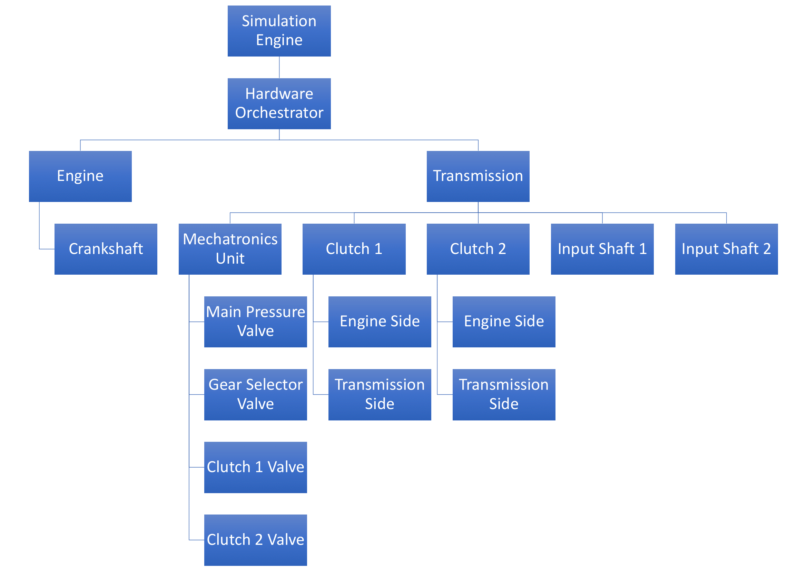

# Simulation Engine

## Parent
- none

## Children
  - [Hardware Orchestrator](hardware-orchestrator.md)
  - [Software Orchestrator](software-orchestrator.md)

## Description
The simulation engine is the root of the actual simulation. It manages the simulation loop, the delta time, etc. It also 
acts as the communication interface between the hardware and software part. It does so by injecting a communication object 
as dependency to all its child components.  
It is the only component that has no parent.  

### Update Cycle
The simulation uses a system we call the "update cycle". Per cycle each component gets the chance to update its state once.
Note, that components can refuse to update if they are throttled. In that case they will just return to the parent.
The update cycle principle means that the resolution of the simulation depends on the number of cycles performed per second. 
The more, the better.  

Each cycle is started by the simulation engine by sending an update signal to the top most component in the hierarchy.
This will always be the [hardware orchestrator](./hardware-orchestrator.md) (see why below). It will forward the update
signal to its first child component, who sends it to its first child component, etc. After the bottom most component is 
reached, it will start to update its state. Once it's done its parent component will send the signal to its next child, 
which will update its state. Once all child components have updated their state, the parent component will then start to
update its own state.

You can think of the process as follows:


In this example the simulation engine sends the update signal to the engine component, which forwards it to the crankshaft
component. Once the crankshaft receives the signal is starts to update its state (e.g. rpm). After its done the engine updates 
its state (e.g. rpm).  
After the hardware orchestrator receives confirmation that the engine has finished updating its state it sends the update 
signal to the transmission component which forwards it to the mechatronics unit, which then forwards it to the main pressure
valve. After that has updated its state the mechatronics unit sends the update signal to the gear selector valve, etc.  
This continues until the last component of the hardware orchestrator is updated.

This principle can be written as follows:
```
Receive update signal -> forward signal to child components -> wait for all children to update -> update self
```

> [!IMPORTANT]  
> The above image does not represent the original structure and is only meant for better understanding.


> [!NOTE]  
> Because the software is used to control the hardware, the hardware components are *always* updated before any software component.

---
